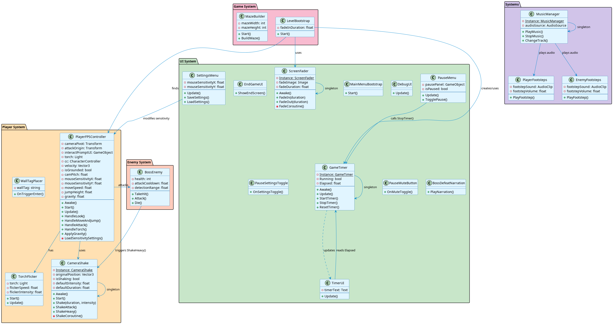

# La Tombe de Kothar — Jeu Unity 3D

Jeu de labyrinthe en vue à la première personne développé avec Unity 2022 (ETNA Master 1 — IDV-G4ME). Groupe de 4.

## Gameplay

Le joueur est piégé dans **la Tombe de Kothar**, un labyrinthe généré procéduralement. Pour s'échapper, il doit trouver le boss, le vaincre en 3 coups, puis franchir la porte de sortie.

**Contrôles :** ZQSD + souris (vue FPS), Shift (course), Espace (saut), Clic gauche (attaque), F (torche), Clic droit (marquer un mur)

## Systèmes clés

**Génération procédurale** — `MazeBuilder.cs` implémente un DFS (Depth-First Search) avec backtracking. La grille (9×9 par défaut) produit un labyrinthe différent à chaque partie, paramétrable via `seed`.

**Boss Kothar** — `BossEnemy.cs` utilise le NavMesh Unity pour l'IA de déplacement. Invincibilité temporaire de 0,5 s après chaque coup, flash rouge sur hit, déclenchement d'un événement global `OnBossDefeated` à la mort.

**Système de portes** — La porte de sortie écoute `OnBossDefeated` et se déverrouille uniquement après la victoire.

**Contrôleur FPS** — `PlayerFPSController.cs` : déplacement, saut, attaque melee (portée 1,8u), interaction avec objets, chargement des paramètres de sensibilité sauvegardés.

## Architecture

```
Assets/
├── Scripts/
│   ├── Game/           # MazeBuilder, LevelBootstrap, GameTimer
│   ├── Player/         # PlayerFPSController, CameraShake, TorchFlicker, WallTagPlacer
│   ├── Enemies/        # BossEnemy
│   ├── Interactables/  # LockedDoor, OpenDoor, DoorFrame
│   ├── Traps/          # FallTrapTile
│   ├── Systems/        # PlayerFootsteps, EnemyFootsteps, MusicManager
│   └── UI/
├── Scenes/             # MainMenu.unity, Level1.unity
├── Prefabs/            # Player, Enemies, Doors, UI
└── Art/                # Materials, Audio, Animations
```

## Stack technique

- Unity 2022.3.47f1 (LTS), C#
- NavMesh (IA boss), CharacterController (joueur)
- Génération procédurale (DFS), ScriptableObjects, événements C#

## Captures d'écran


## UML



> **Note :** Les assets tiers (`Plugins/`) et le build final ne sont pas inclus dans ce repo pour des raisons de taille.
